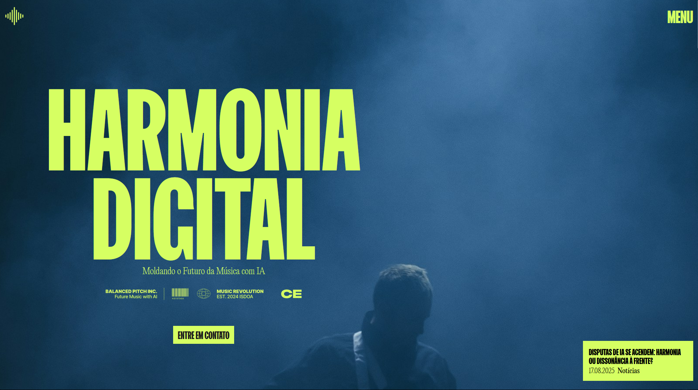
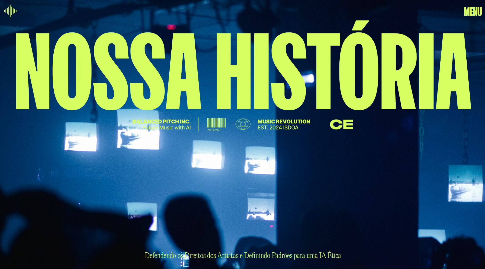
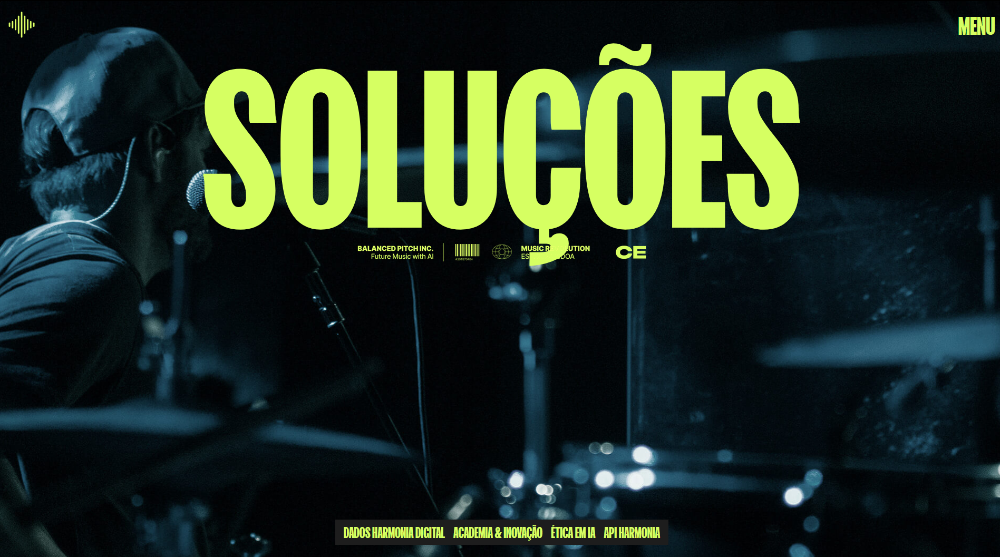

# Harmonia Digital | Estudo de Animações com React e GSAP

> Um projeto de estudo de **[SAIKO9X](https://github.com/SAIKO9X)**

---

## 📖 Sobre o Projeto

Este repositório apresenta um **estudo técnico avançado de front-end**, materializado como o site conceitual da **"Harmonia Digital"**, uma organização fictícia dedicada à promoção da ética no uso de Inteligência Artificial na indústria musical.

O projeto foi desenvolvido como uma peça de portfólio com o objetivo de demonstrar a implementação de um design arrojado e corporativo, repleto de micro-interações e animações complexas. O foco principal foi o uso da biblioteca **GSAP (GreenSock Animation Platform)**, especialmente o plugin **ScrollTrigger**, para criar uma experiência de navegação imersiva e dinâmica em um ambiente React.

---

## ✨ Visualização do Projeto

**Página Inicial**

**Página Sobre**

**Página de Soluções**

---

## 🚀 Funcionalidades e Animações em Destaque

Este projeto foi construído para explorar diversas técnicas de animação e criar uma interface polida e moderna.

- **Animações Ricas com GSAP e ScrollTrigger:**

  - **Efeito Parallax:** Implementado em múltiplas imagens para adicionar profundidade e dinamismo durante a rolagem.
  - **Animações Sincronizadas com Scroll:** Efeitos criativos como a fita cassete na página inicial, que se move de acordo com a posição do usuário na página.
  - **Entrada Escalonada (Stagger):** Listas e seções de conteúdo aparecem de forma suave e sequencial, guiando o olhar do usuário e melhorando a experiência de leitura.
  - **Pinning de Seções:** Seções como a de "Equipe" são fixadas na tela para criar interações de layout mais complexas e interessantes.

- **Menu com Animação Complexa:**

  - Uma animação de abertura e fechamento de "cortina dupla" utilizando `clip-path` do CSS, totalmente orquestrada com GSAP para um efeito único e memorável.

- **Scroll Suave e Performático:**

  - Implementação da biblioteca `Lenis` para garantir uma navegação fluida e agradável em todas as páginas.

- **Design Responsivo:**
  - O layout e as animações são totalmente adaptáveis para garantir uma experiência consistente em desktops e dispositivos móveis.

---

## 🛠️ Tecnologias Utilizadas

- **React:** Biblioteca principal para a construção da interface.
- **React Router:** Para o gerenciamento de rotas da aplicação.
- **GSAP (GreenSock):** A principal ferramenta de animação, utilizada para a maioria das interações, efeitos de parallax e animações baseadas em scroll (`ScrollTrigger`).
- **Lenis:** Para a implementação do scroll suave.
- **Vite:** Como ferramenta de build e servidor de desenvolvimento.

---

## 📄 Créditos e Inspiração

- Este projeto é um trabalho de estudo pessoal, com design e interações fortemente inspirados em layouts de agências e estúdios de alto nível encontrados no **Awwwards**.
- Parte das técnicas de animação foi aprendida e adaptada a partir dos excelentes tutoriais do canal **[CodeGrid no YouTube](https://www.youtube.com/@codegrid)**.
- A identidade e todo o conteúdo da "Harmonia Digital" são fictícios, criados exclusivamente para fins de demonstração neste rebuild.
- As imagens utilizadas são de bancos de imagens gratuitos como Unsplash e Pexels.

---

## 📝 Licença

Este projeto está sob a licença MIT.
